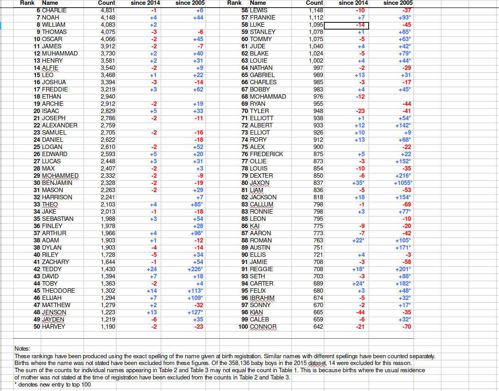
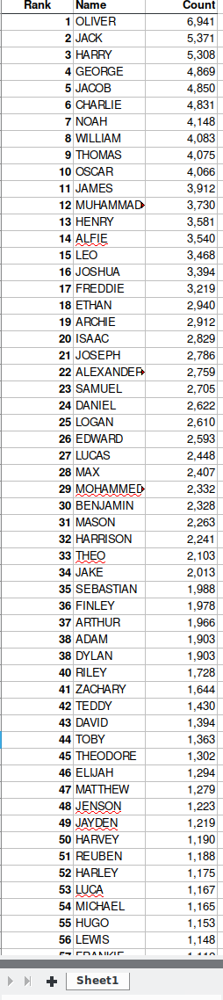

Workshop overview and materials
===============================

Workshop description
--------------------

Statistics courses usually use clean and well-behaved data for examples and
homework. This leaves many students unprepared for the messiness and chaos of
data in the real world. This workshop aims to prepare you for dealing with messy
data by walking you through real-life example.

This is an intermediate/advanced R course appropriate for those with basic
knowledge of R.

This workshop uses
the [tidyverse](https://cran.r-project.org/web/packages/tidyverse/index.html)
package which provides more consistent file IO
([readr](https://cran.r-project.org/web/packages/readr/index.html)
and [readxl](https://cran.r-project.org/web/packages/readxl/index.html)), string
manipulation
([stringr](https://cran.r-project.org/web/packages/dplyr/index.html), and
functional programming
([purrr](https://cran.r-project.org/web/packages/purrr/index.html)) tools for R.

Materials and setup
-------------------

**NOTE: skip this section if you are running these examples in your web browser at tutorials-live.iq.harvard.edu**

Everyone should have R installed -- if not:

-   Open a web browser and go to <http://cran.r-project.org> and download and
    install it
-   Also helpful to install RStudio (download from <http://rstudio.com>)
-   Open R and install the =tidyverse= package

```{r}
## install.packages("tidyverse")
```

Example project overview
------------------------

It is common for data to be made available on a website somewhere, either by a
government agency, research group, or other organizations and entities. Often
the data you want is spread over many files, and retrieving it all one file at a
time is tedious and time consuming. Such is the case with the baby names data we
will be using today.

The UK [Office for National Statistics](https://www.ons.gov.uk) provides yearly
data on the most popular baby names going back to 1996. The data is provided
separately for boys and girls and is stored in Excel spreadsheets.

I have downloaded all the excel files containing boys names data. Our mission is
to extract and graph the top 100 boys names in England and Wales for every year
since 1996. There are several things that make this challenging:

1. The worksheet containing the data of interest is in different positions and.
has different names from one year to the next. However, it always includes
"Table 1" in the worksheet name.
2. The data does not start on row one. Headers are on row 7, followed by a blank
   line, followed by the actual data.
3. The data is stored in an inconvenient way, with ranks 1-50 in the first set.
of columns and ranks 51-100 in a separate set of columns.
4. Some years include columns for "changes in rank", others do not.
5. There are notes below the data.

As you can see, we have a lot of work to do. Let's get started.

Iterating over a directory of files
================================================

Our first task is to iterate over all the data files and read the appropriate
sheet from each one. As noted above, the appropriate sheet differs from year to
year, but always has "Table 1" in the sheet name.

The first step is to get a vector of file names.

```{R}
boy.file.names <- list.files("babyNamesData/boys", full.names = TRUE)
```

Now we can iterate over the file names and get the names of each worksheet. We
could use a `for` loop, or `sapply`, but the `map` family of functions from the *purrr*
package gives us a more consistent alternative, so we'll use that.

```{r}
map(boy.file.names, excel_sheets)
```

Filtering strings using regular expressions
===========================================================

In order extract the correct worksheet names we will use functions for
manipulating strings. Base R provides some string manipulation capabilities (see
`?regex`, `?sub` and `?grep`), but I recommend either
the [stringr](https://cran.r-project.org/web/packages/stringr/index.html)
or [stringi](https://cran.r-project.org/web/packages/stringi/index.html)
packages. The *stringr* package is more user-friendly, and the *stringi* package
is more powerful and complex. Let's use the friendlier one. While we're
attaching packages we'll also attach
the [readxl](https://cran.r-project.org/web/packages/readxl/index.html) package
and
the [tidyverse](https://cran.r-project.org/web/packages/tidyverse/index.html)
package which provides more modern versions of many basic functions in R.

```{r}
library(tidyverse)
library(stringr)
library(readxl)
```
The *string* package provides functions to detect, locate, extract, match,
replace, and split strings (among other things). Here we want to detect the
pattern "Table 1", and only return elements with this pattern. We can do that
using the `str_subset` function. The first argument to `str_subset` is character
vector we want to search in. The second argument is a *regular expression*
matching the pattern we want to retain.

If you are not familiar with regular expressions, <http://www.regexr.com/> is a
good place to start.

Now that we know how to filter character vectors using `str_subset` we can
identify the correct sheets for each year.

```{r}
findTable1 <- function(x) {
  str_subset(excel_sheets(x), "Table 1")
}

map(boy.file.names, findTable1)
```

Reading all the files
=============================

Next we want to read the correct worksheet from each file. We already know how
to iterate over a vector of file names with `map`, and we know how to identify
the correct sheet. All we need to do next is read that sheet into R. We can do
that using the `read_excel` function.

Recall that the actual data starts on row 7, so we want to skip the first 6
rows.

```{r}
readTable1 <- function(file) {
  read_excel(file, sheet = findTable1(file), skip = 6)
}

boysNames <- map(boy.file.names, readTable1)
glimpse(boysNames[[1]])
```


Data cleanup
================

Now that we've read in the data we still have some cleanup to do. Namely we need
to:

1. fix column names
2. get rid of blank row and the top and the notes at the bottom
3. get rid of extraneous "changes in rank" columns if they exist
4. transform the side-by-side tables layout to a single table.

In short, we want to go from this:



to this:



There are many ways to do this kind of data manipulation in R. We're going to
use the *dplyr* and *tidyr* packages to make our lives easier. Both packages
were attached along with the *tidyverse* package.

Fixing column names
-------------------------
The column names are in bad shape. In R we need column names to a) start with a
letter, b) contain only letters, numbers, underscores and periods, and c)
uniquely identify each column.

The actual column names look like this:
```{r}
names(boysNames[[1]])
```

So we need to a) make sure each column has a name, and b) distinguish between
the first and second occurances of "Name" and "Count". We could do this
step-by-step, but there is a handy function in R called `make.names` that will
do it for us.

```{r}
names(boysNames[[1]])
make.names(names(boysNames[[1]]), unique = TRUE)
names(boysNames[[1]]) <- make.names(names(boysNames[[1]]), unique = TRUE)
names(boysNames[[1]])
```

Of course we need to iterate over each data.frame in the `boysNames` list and to
this for each one. Fortunately the `map` function makes this easy.

```{r}
boysNames <- map(boysNames,
                 function(x) {
                   names(x) <- make.names(names(x), unique = TRUE)
                   x
                 })
```

Filtering rows
------------------

Next we want to remove blank rows and rows used for notes. An easy way to do
that is to remove rows that don't have a name. We can filter on some condition
using the `filter` function, like this:

```{r}
boysNames[[1]]
boysNames[[1]] <- filter(boysNames[[1]], !is.na(Name))
boysNames[[1]]
```

Of course we need to do that for every data set in the `boysNames` list, but
I'll leave that to you.

Selecting columns
----------------------

Next we want to retain just the `Name`, `Name.1` and `Count`, `Count.1` columns.
We can do that using the `select` function:


```{r}
boysNames[[1]]
boysNames[[1]] <- select(boysNames[[1]], Name, Name.1, Count, Count.1)
boysNames[[1]]
```

Again we will want to do this for all the elements in `boysNames`, a task I
leave to you.

Re-arranging into a single table
-----------------------------------------

Our final task is to re-arrange to data so that it is all in a single table
instead of in two side-by-side tables. For many similar tasks the `gather`
function in the *tidyr* package is useful, but in this case we will be better
off using a combination of `select` and `bind_rows`.

```{r}
boysNames[[1]]
bind_rows(select(boysNames[[1]], Name, Count),
          select(boysNames[[1]], Name = Name.1, Count = Count.1))
```

Exercise: Cleanup all the data
=========================================

In the previous examples we learned how to drop empty rows with `filter`, select
only relevant columns with `select`, and re-arrange our data with `select` and
`bind_rows`. In each case we applied the changes only to the first element of
our `boysNames` list. Your task now is to use the `map` function to apply each
of these transformations to all the elements in `boysNames`.
